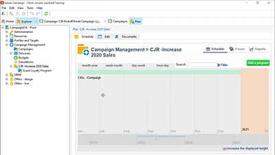

# Tutorials do console do cliente do Adobe Campaign v8

O Adobe Campaign oferece uma plataforma para criar experiências do cliente entre canais, além de um ambiente para orquestração visual de campanhas, gestão de interações em tempo real e cross-channel execution. Este guia do usuário contém vídeos e tutoriais sobre os vários recursos e funcionalidades do Console do cliente do Adobe Campaign V8.

Consulte

>[!INFO]
> Você tem dúvidas? Deseja compartilhar sua experiência ou trocar ideias com colegas? Ou você quer compartilhar seu feedback sobre o conteúdo de aprendizado com a equipe da Adobe? Participe da conversa no [thread da comunidade de aprendizagem do Adobe Campaign](https://experienceleaguecommunities.adobe.com:443/t5/adobe-campaign-classic/join-the-discussion-on-adobe-campaign-learning/td-p/419096).
> 
> Esses tutoriais não são o que você está procurando?
> Consulte os [Tutoriais da interface do Adobe Campaign Web](https://experienceleague.adobe.com/docs/campaign-web-learn/tutorials/overview.html?lang=pt-BR) para obter orientação sobre como usar a interface do Campaign Web.

>[!NOTE]
> O Campaign v8 está disponível somente como um Cloud Service gerenciado e não pode ser implantado em um ambiente local ou híbrido. A migração automatizada de um ambiente existente do Campaign Classic v7 ainda não está disponível.
>
>Consulte a [documentação do produto](https://experienceleague.adobe.com/docs/campaign/campaign-v8/new/v7-to-v8.html?lang=pt-BR) para obter mais informações sobre a transição do Classic v7 para o V8.

## Escolhas de pessoal

<table>
<tr>
  <td>
    
    

      <a href="/help/get-started/create-a-marketing-plan-programs-and-campaigns.md">
     <strong>Criar um plano de marketing</strong>
    </a>
    

    

    <em>Saiba como criar campanhas, um programa e um plano de marketing.</em>
    

  </td>
   <td>
    
    

      <a href="./content-creation/create-and-design-email-deliveries.md">
   <strong>Criar e projetar entregas de email</strong>
    </a>
    

    

    <em>Saiba mais sobre o processo de criação de uma entrega de email e como projetar e personalizar conteúdo de email.
</em>
    

  </td>
  <td>
    
    

      <a href="./send-messages/fatigue-management/typology-rules-for-fatigue-management.md">
    <strong>Gerenciar fadiga usando regras de tipologia</strong>
    </a>
    

    

    <em>Saiba como implementar o gerenciamento de fadiga no Adobe Campaign usando regras de tipologia </em>
    

  </td>
</tr>
<tr>
</td>
  <td>
    
    

      <a href="./reporting/generate-a-descriptive-analysis-report.md">
    <strong>Gerar um relatório de análise descritiva</strong>
    </a>
    

    

    <em>Saiba como gerar um relatório de análise descritiva de um fluxo de trabalho.</em>
    

  </td>
  <td>
   
     

      <a href="./data-management/data-management-fundamentals.md">
     <strong>Princípios básicos do gerenciamento de dados com fluxos de trabalho</strong>
    </a>
    

    

    <em>Saiba o que são as dimensões de direcionamento e as tabelas de trabalho, e como o Adobe Campaign gerencia os dados em diferentes fontes de dados.</em>
    

  </td>
  <td>
   
     

      <a href="./data-management/api-staging-mechanism.md">
    <strong>Mecanismo de preparo de API com FFDA</strong>
    </a>
    

    

    <em>Saiba como funciona o mecanismo de preparo da API com Full FDA.</em>
    

  </td>
</tr>
</table>

